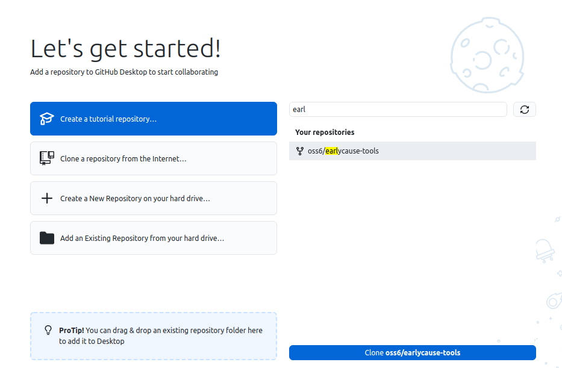
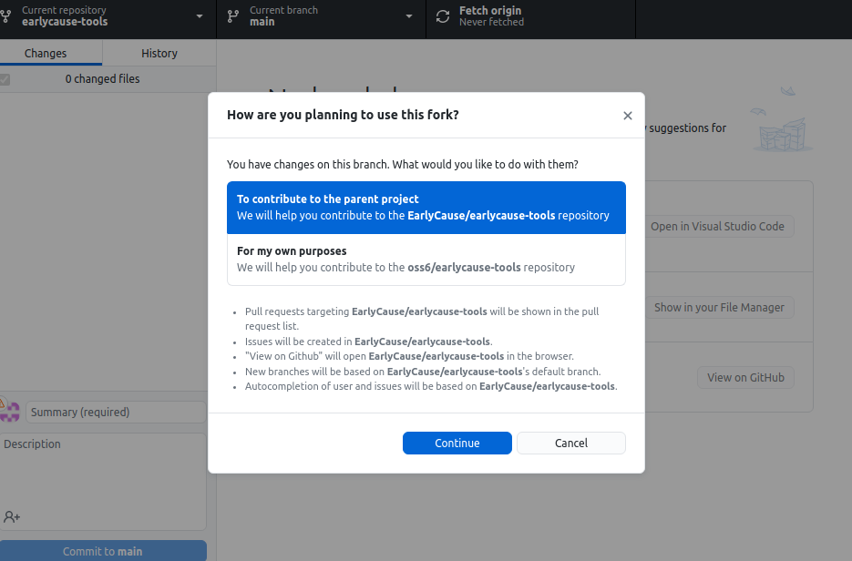
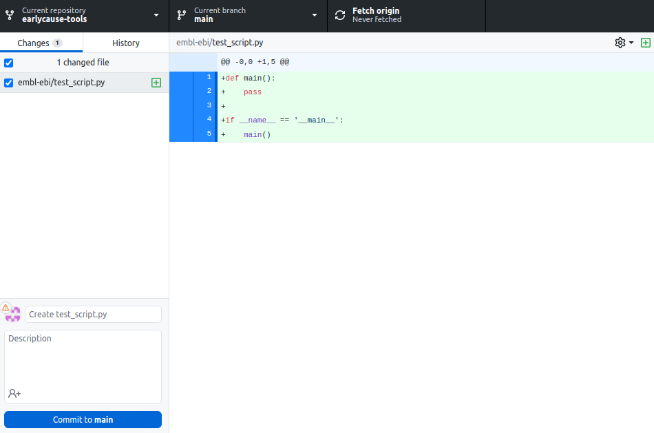
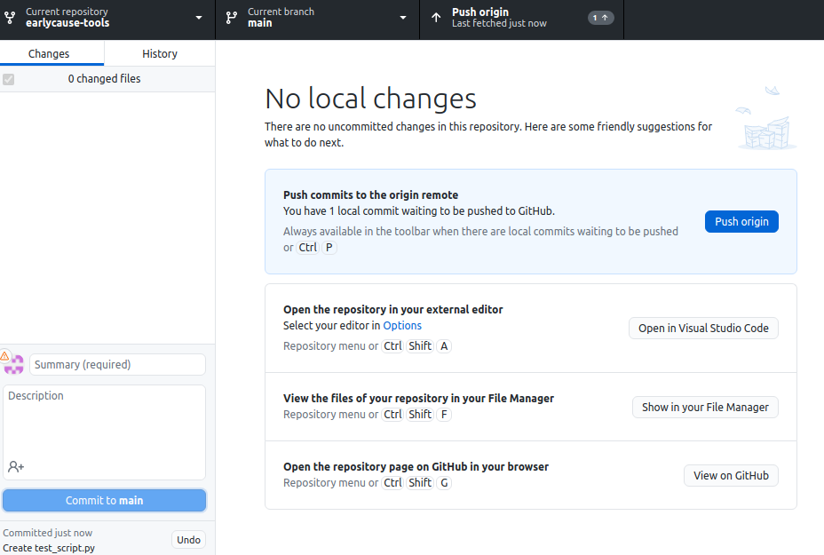
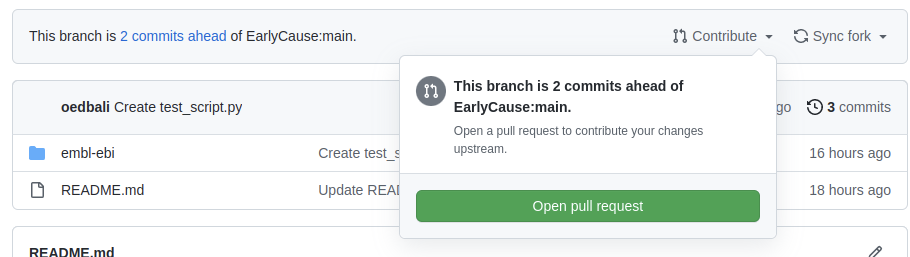

# earlycause-tools

This repository provides a way to share tools that support the [EarlyCause Portal](https://portal.earlycause.eu/).

## Submission process

Before submitting your tools/scripts you have to create a [GitHub](https://github.com/) account, if you haven't already.

### 1. Fork the repository

In order to upload your files you have to "fork" this repository.
This means that GitHub will create a **copy** of the repository under your personal account.

To do this click on the **Fork** button in the top left:

### 2. Install GitHub Desktop

In order to make changes/add files and submit them to the forked repository, you need to install [GitHub Desktop](https://desktop.github.com/).

Once installed, sign-in to GitHub:

### 3. Clone the repository

Now you can clone the forked repository (the one you copied) by searching it through GitHub Desktop and clicking "Clone earlycause-tools":

Once the repository is cloned, you will be prompted on how you would like to use the forked repository; please choose the first option, as shown below:

### 4. Add tools

Now you can add your tools/scripts by opening the repository folder and locating your institution folder.

Once you add files to your institution folder you will see the changes in GitHub Desktop as follows:

Once you're happy with the changes click on "Commit to main" - optioanlly you can provide a description of the changes using the appropriate box.

### 5. Submit for approval

Now the changes you have made are local. In order to push them to your remote forked repository, click "Push origin":

Now you have to create a pull request for the EarlyCause team to review. You can do so in two ways:

- On GitHub Desktop, in the menu bar, click on "Branch" then "Create pull request".
- On the GitHub website, in your forked repository, click on "Contribute" then "Open pull request" (see below)

Once you create the pull request, the EarlyCause team will be notified and will be able to review the changes. Once approved, these will be merged in the parent repository.
